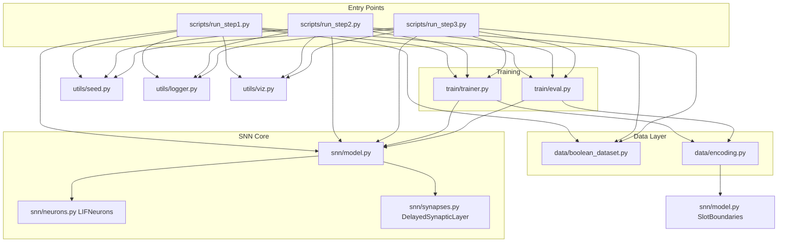
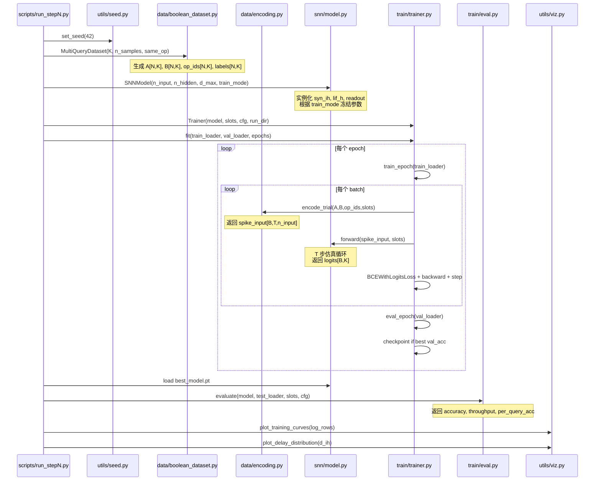
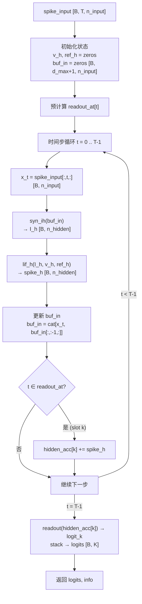
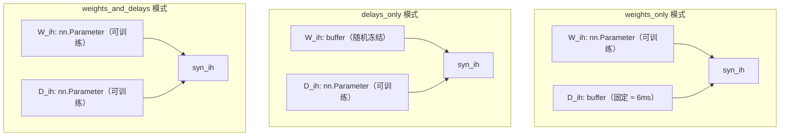

# 系统架构与数据流

> 本文件描述 `snn_async_delays` 项目的模块级架构、数据流时序和张量形状变化，以及异步/延迟机制的架构实现。

---

## 1. 总体架构

### 1.1 系统设计原则

本项目采用"配置驱动、模块分离"的设计：

- **configs/** 是唯一配置源，所有超参均可在 YAML 中定义，CLI 参数允许覆盖
- **data/** 与 **snn/** 完全解耦：data 层只产生张量，不知道模型内部
- **train/** 层通过标准接口（`DataLoader`, `SNNModel`, `SlotBoundaries`）连接两者
- **scripts/** 是可执行入口，负责组装各模块并管理实验输出

### 1.2 三层试验结构

```
Step 1: K=1，单运算，验证"延迟是否提高精度"
Step 2: K=1..8，固定运算，验证"延迟是否提高最大并发查询数"
Step 3: K=1..6，混合运算，验证"延迟是否支持并发多类型查询"
```

三步共享同一套模型代码，通过配置参数区分。

---

## 2. 模块依赖图 (Mermaid)



---

## 3. 训练数据流时序图 (Mermaid)

### 3.1 单次 run_single 调用序列



### 3.2 单个 forward 调用内部流程



---

## 4. 张量形状追踪

### 4.1 数据层张量

| 来源 | 张量 | 形状 | dtype | 说明 |
|------|------|------|-------|------|
| `MultiQueryDataset.__getitem__` | A | `[K]` | float32 | 输入 A（0 或 1） |
| `MultiQueryDataset.__getitem__` | B | `[K]` | float32 | 输入 B（0 或 1） |
| `MultiQueryDataset.__getitem__` | op_ids | `[K]` | int64 | 运算索引 |
| `MultiQueryDataset.__getitem__` | labels | `[K]` | float32 | 目标标签 |
| DataLoader 批量化后 | A | `[B, K]` | float32 | |
| DataLoader 批量化后 | labels | `[B, K]` | float32 | |

注：Step1 的 `BooleanDataset` 返回标量，Trainer 中 `unsqueeze(1)` 转为 `[B, 1]`。

### 4.2 编码层张量

| 变量 | 形状 | 计算方式 | 说明 |
|------|------|----------|------|
| `spike_input` | `[B, T, n_input]` | `encode_trial()` 输出 | T = slots[-1].read_end |
| T (Step1) | 50 | win_len=40 + read_len=10 | 单槽试次长度 |
| T (Step2, K=3) | 105 | K × (20+10+5) = 105 | 三槽试次长度 |
| n_input (Step1/2) | 2 | A 通道 + B 通道 | |
| n_input (Step3) | 10 | 2 + 8 (one-hot op) | |

### 4.3 SNN 内部张量

| 变量 | 形状 | 来源 | 说明 |
|------|------|------|------|
| `buf_in` | `[B, d_max+1, n_input]` | `model.forward` 初始化 | 输入延迟环形缓冲 |
| `x_t` | `[B, n_input]` | `spike_input[:,t,:]` | 当前时步输入脉冲 |
| `I_h` | `[B, n_hidden]` | `syn_ih(buf_in)` | 延迟后突触电流 |
| `spike_h` | `[B, n_hidden]` | `lif_h(I_h, v_h, ref_h)` | 隐藏层脉冲 |
| `v_h` | `[B, n_hidden]` | LIF 状态 | 膜电位（每步更新） |
| `ref_h` | `[B, n_hidden]` | LIF 状态 | 不应期倒计时 |
| `hidden_acc[k]` | `[B, n_hidden]` | 读出窗口累积 | 第 k 槽的脉冲计数 |
| `logits` | `[B, K]` | `stack(readout(acc[k]))` | 每槽输出 logit |

### 4.4 突触层内部张量（单次 forward）

| 变量 | 形状 | 说明 |
|------|------|------|
| `buf` 输入 | `[B, d_max+1, n_pre]` | 历史脉冲缓冲区 |
| `delay_raw` | `[n_pre, n_post]` | 原始延迟参数 |
| `d_cont` | `[n_pre, n_post]` | sigmoid 映射后连续延迟 |
| `d_floor` | `[n_pre, n_post]` | floor 索引（long，detached） |
| `alpha` | `[n_pre, n_post]` | 小数部分（梯度流经此处） |
| `buf_i` | `[B, d_max+1]` | 第 i 个输入神经元的历史 |
| `s_f` | `[B, n_post]` | floor 处的延迟脉冲 |
| `s_c` | `[B, n_post]` | ceil 处的延迟脉冲 |
| `s_i` | `[B, n_post]` | 线性插值后的有效脉冲 |
| `I_syn` 返回 | `[B, n_post]` | 总突触电流 |

### 4.5 训练损失计算

| 变量 | 形状 | 说明 |
|------|------|------|
| `logits` | `[B, K]` | 模型输出 |
| `labels` | `[B, K]` | 目标标签 |
| `logits.reshape(-1)` | `[B*K]` | 展平为 1D |
| `BCEWithLogitsLoss` 输出 | 标量 | 平均二元交叉熵 |

---

## 5. 异步/延迟机制的架构实现

### 5.1 概念层次

```
研究假说：延迟使能 SNN 在同一神经元集合上处理更多并发查询
         ↕
架构实现：时间槽（temporal slots）+ 延迟缓冲区（delay buffer）
         ↕
数学基础：连续延迟参数化 + 线性插值 + 代理梯度
```

### 5.2 时间槽结构

多查询实验的核心是将一个试次划分为 K 个时间槽，每槽包含：


**关键约束（确保真正测试时间复用）：**
1. 读出窗口在每槽末尾，不是试次末尾（逐槽读出）
2. K 个查询在同一神经元集合上串行处理（不使用空间并行通道）
3. 神经元状态（v, ref, buf）在槽间连续传递，不重置

### 5.3 延迟如何实现异步处理

在无延迟的 SNN 中，每个时步的信息立即传播，神经元很难区分来自不同槽的信号。引入延迟后：

1. 不同突触的延迟值不同（通过学习优化）
2. 来自槽 k 的脉冲经过 $d_{ij}$ 步后到达目标神经元
3. 网络可以学习：让不同槽的信息在时间上"错开"到达，从而分时复用同一组神经元

**延迟学习的梯度流路径：**

```
loss
 ↓ backward
logits[B,K]
 ↓ (readout.weight)
hidden_acc[k][B,n_hidden]  (某槽的脉冲累积)
 ↓ (通过仿真时间步)
spike_h[B,n_hidden]        (LIF 代理梯度)
 ↓ (_SurrogateSpike.backward)
I_h[B,n_hidden]            (突触电流)
 ↓ (DelayedSynapticLayer.forward: ∂I/∂alpha)
alpha[n_pre,n_post]        (连续延迟小数部分)
 ↓ (alpha = d_cont - floor)
d_cont[n_pre,n_post]       (sigmoid 映射后延迟)
 ↓ (d_max * sigmoid(d_raw))
d_raw[n_pre,n_post]        (可训练参数, optimizer 更新)
```

### 5.4 能量归一化吞吐量指标

核心研究指标：在精度达到阈值τ的条件下，能量归一化吞吐量 $K / \text{spikes}$ 随延迟使能的变化。

```
throughput = K / mean_hidden_spikes_per_trial

期望结果：
  weights_and_delays 以较少脉冲支持更高 K
  → 单位能量处理更多查询
```

这个指标的分子（K）和分母（spikes）都在同一 forward 调用中计算，确保公平比较。

### 5.5 模式对比架构图



三种模式共享同一 `SNNModel` 代码，通过 `train_mode` 参数在 `__init__` 时决定参数注册方式（`nn.Parameter` vs `register_buffer`）。
