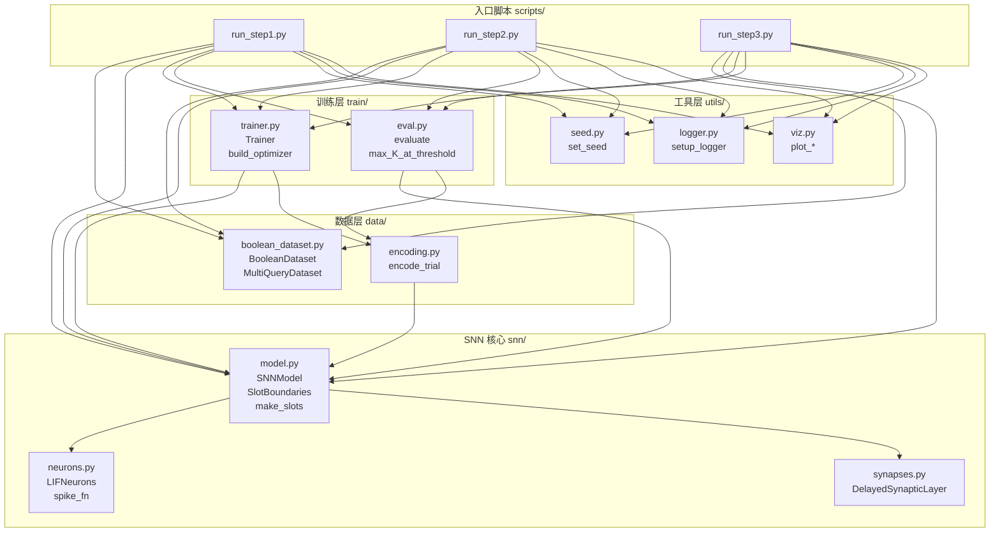
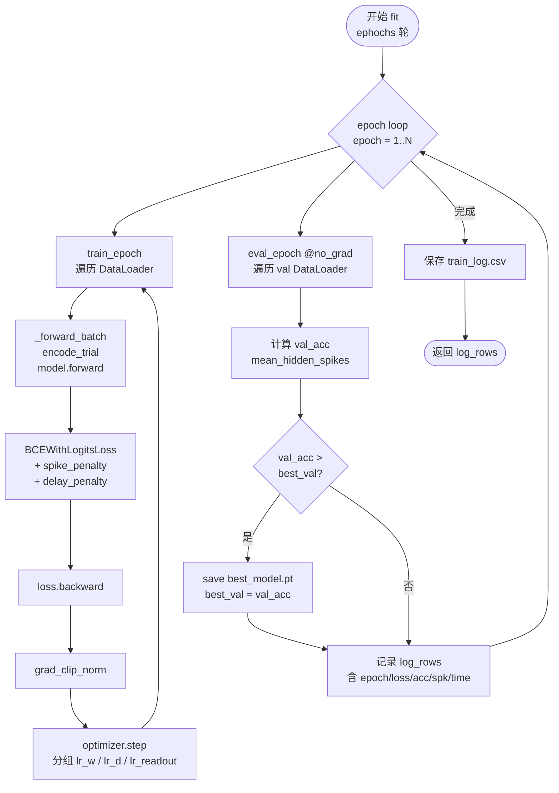
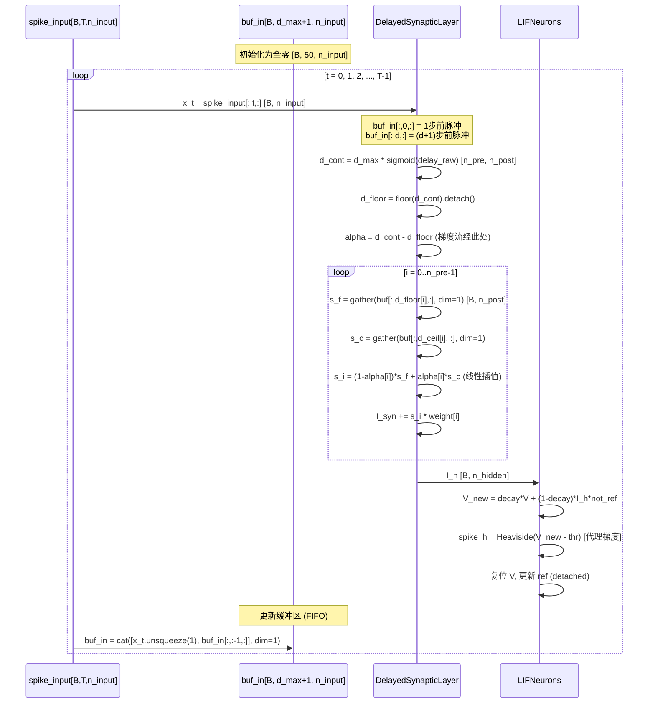
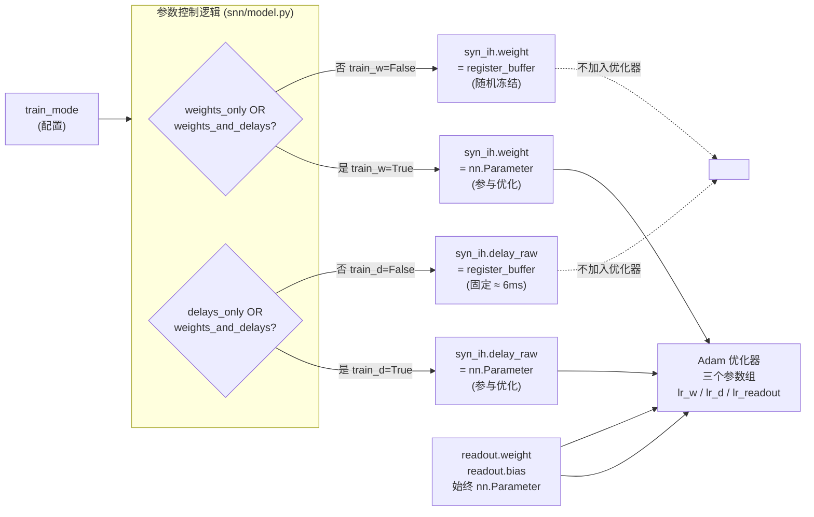

# 架构概览图集（Mermaid）

> 本文件包含所有 Mermaid 图表，可在支持 Mermaid 渲染的 Markdown 查看器（如 VS Code、GitHub、Obsidian）中显示。

---

## 图 1：模块依赖图

---

## 图 2：前向传播数据流

```mermaid
flowchart LR
    subgraph "输入编码"
        A["A[B,K] B[B,K] op_ids[B,K]"]
        ENC["encode_trial()\nPoisson 采样"]
        SI["spike_input\n[B, T, n_input]"]
        A --> ENC --> SI
    end

    subgraph "SNN 仿真 (T 步循环)"
        BUF["buf_in\n[B, d_max+1, n_input]\n延迟环形缓冲区"]
        SYN_IH["syn_ih.forward(buf)\nW_ih + D_ih\n线性插值延迟"]
        IH["I_h\n[B, n_hidden]\n突触电流"]
        LIF_H["lif_h.forward(I_h, v, ref)\nLIF 更新\n代理梯度"]
        SPK["spike_h\n[B, n_hidden]"]
        ACC["hidden_acc[k]\n[B, n_hidden]\n读出窗口累积"]

        BUF --> SYN_IH --> IH --> LIF_H --> SPK
        SI -- "x_t = [:,t,:]" --> BUF
        SPK -- "cat 更新 buf_in" --> BUF
        SPK -- "若 t ∈ readout_at[k]" --> ACC
    end

    subgraph "线性读出"
        RO["readout\n[n_hidden → 1]"]
        LOGIT["logits\n[B, K]"]
        ACC --> RO --> LOGIT
    end

    subgraph "损失"
        LOSS["BCEWithLogitsLoss\nlogits.reshape(-1)\nlabels.reshape(-1)"]
        LOGIT --> LOSS
    end
```

---

## 图 3：训练循环流程

---

## 图 4：延迟缓冲区机制

---

## 图 5：多查询时间槽结构（K=3 示例）

```mermaid
gantt
    title K=3 试次时间结构 (Step2: win=20, read=10, gap=5 ms)
    dateFormat X
    axisFormat %s ms

    section Slot 0
    输入窗口 (A0,B0) : 0, 20
    读出窗口 → logit0 : 20, 30
    间隔 : 30, 35

    section Slot 1
    输入窗口 (A1,B1) : 35, 55
    读出窗口 → logit1 : 55, 65
    间隔 : 65, 70

    section Slot 2
    输入窗口 (A2,B2) : 70, 90
    读出窗口 → logit2 : 90, 100
    间隔 : 100, 105
```

**关键特性：**
- 神经元状态（`v_h`, `ref_h`, `buf_in`）跨槽连续，不重置
- 每槽有独立读出累积器 `hidden_acc[k]`
- 损失在 K=3 个查询上联合优化：`BCELoss(logits[B,3].reshape(-1), labels[B,3].reshape(-1))`

---

## 图 6：train_mode 参数冻结机制

