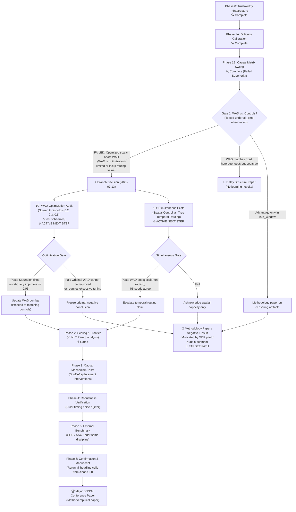

# Publication Roadmap Flowchart & Guide (Updated 2026-07-13)

Following the findings from `RESULTS_XOR_DELAY_CONTROL_MATRIX_V1.md` on **2026-07-13**, the publication roadmap has branched. **Gate 1 positive superiority failed** (an optimized scalar delay outperformed WAD on the primary XOR endpoint).

The active focus has shifted to a **causal decomposition / methodology-negative-result programme** to investigate whether WAD was optimization-limited and if WAD provides value in simultaneous routing.

---

## 1. Updated Phased Experimental Flowchart

---

## 2. Updated Scientific Gates & Branching Actions (2026-07-13)

### 2.1 1C: WAD Optimization Audit (`wad_optimization_audit_v1`)
*   **Objective**: Diagnose if WAD failed Gate 1 due to optimization constraints.
*   **Stage A (Screening)**: Test threshold values $\{0.2, 0.3, 0.5\}$ checking for firing and gradient viability.
*   **Stage B (Optimization Schedules)**: Grid-search combinations of $d_{\max}$, delay learning rates, and warm-up/alternating training schedules on viable thresholds.
*   **Optimization Gate**: WAD must improve validation worst-query accuracy by $\ge 0.03$ over the original baseline in at least 2/3 of seeds without getting more tuning budget than the scalar delay. Otherwise, the original negative conclusion is frozen.

### 2.2 1D: Simultaneous-Input Pilots
*   **Spatial Control (`simultaneous_spatial_control_pilot_v1`)**: Multiple simultaneous query inputs mapped to independent outputs. Measures spatial parallel multitask capacity, not temporal routing.
*   **True Temporal Routing (`simultaneous_temporal_routing_pilot_v1`)**: Shared hidden layer, simultaneous inputs, and a shared opponent output pair reused across ordered output windows. Measures true delay-based routing.
*   **Simultaneous Gate**: WAD must outperform the scalar delay and fixed-delay controls on worst-window and exact-trial reliability in at least 4/5 paired seeds.

---

> [!WARNING]
> **Data Integrity Constraint**:
> Under the current negative-result branch, **do not open the sealed test split** or expand parameters ($K/N$) to avoid p-hacking. All current calibration and audit runs must remain validation-only.
